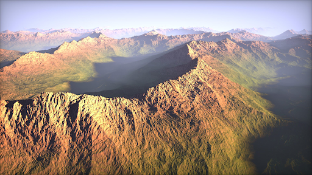

https://discordapp.com/channels/@me/689505435551924454/709501071466168394

# Perlin-noise based realistic mountain terrain

# Summary

Generate a detailed realistic terrain using OpenGL/WebGL and perlin noise, including mountains and lakes with reflections and water movement.  

# Goals and Deliverables

The minimum implementation of our project (4.0) is a mountain range terrain generated by perlin noise with the appropriate elevation texture. We will also have phong lighting and shadows and we can move the camera around to explore the terrain. Our terrain will be significantly larger than the assignment 7 terrain and the mountains will have more detailed texture. The biggest problem we might encounter is to start the project on OpenGL because we have been working on WebGL the whole time. For example, moving the camera in WebGL is relatively easy, but in OpenGL, it might be really hard. If we spend too much time trying to set up the project in OpenGL, we can move to WebGL. 

For a better grade (5.5), our implementation will include adding realistic water texture (e to our lakes with reflections of the terrain. We will also implement in our scene a sun and a moon and rotate them around our terrain rotation while changing the light source. Finally, we will add fog and clouds to our world.

For an exceptional grade (6.0), we can work on the additional features described below. We will choose an additional feature according to our interest and the time remaining.

Our final results want to be similar to the images presented above. There will be a sun and a moon rotating around our terrain which changes the lighting of our world. We can move around our world by rotating our camera.

Objectives:

* Easy - Passing grade
    * Perlin noise
        * Assignment 7
    * Elevation 
        * Snow at top, brown in middle, green at bottom, water at the end.
        * Assignment 7
    * Terrain
        * Assignment 7
    * Moving the camera around a center point
        * Assignment 4
    * Phong lighting
        * Specular effect on water or we can put an object on our terrain
        * Assignment 5
    * Shadows
        * Assignment 6
* Medium - Better grade
    * Realistic water
    * Sun and moon rotation - change the light source, intensity of the light as the time goes by
    * Fog, clouds
    * Additional feature - birds flying around in predetermined circle
* Hard - Better grade
    * Reflection of mountains on water
    * Additional feature - moving the camera anywhere on the map
    * Additional feature - small particles (leaves, grass, snow, rain)
* Very Hard
    * Additional feature - Trees and grass on terrain

# Schedule

* Week 1 (April 20)
    * Tuesday, April 21 - Project proposal due - everybody
    * Friday, April 24 - Proposal feedback due - everybody
    * Finalize the details of the project - everybody
* Week 2 (April 27)
    * Set up the project files - Bartek
    * Perlin noise - Fan
    * Elevation - Gianni
    * Terrain - Bartek
* Week 3 (May 4)
    * Moving the camera around a center point - Gianni
    * Phong lighting - Fan
    * Shadows - Fan
    * Sun and moon rotation - Bartek
    * Day and night transition - Gianni
* Week 4 (May 11)
    * Tuesday May 12, 1PM - Milestone report due - everybody
    * Realistic water - Gianni, Fan
    * Reflection of mountains on water - Bartek
    * Additional features like fog, clouds, particle effects
* Week 5 (May 18)
    * Other additional features - we’ll work on them together depending what will be the particular interest of each team member
* Week 6 (May 26)
    * Tuesday May 26, 1PM - Final presentation video due - everybody
    * Friday May 29, 1PM - Final report webpage due - everybody

# Resources

From the project description

https://www.redblobgames.com/maps/terrain-from-noise/

Understanding perlin noise

https://flafla2.github.io/2014/08/09/perlinnoise.html

Using perlin noise to create terrain and water

https://gpfault.net/posts/perlin-noise.txt.html

Using Perlin Noise to Create a Terrain Mesh

https://www.scratchapixel.com/lessons/procedural-generation-virtual-worlds/perlin-noise-part-2/perlin-noise-terrain-mesh

Basic water tutorial

https://www.chinedufn.com/3d-webgl-basic-water-tutorial/

Texture & Modeling “A procedural approach” by Ken Perlin and others

Particles

https://learnopengl.com/In-Practice/2D-Game/Particles

https://www.3dgep.com/simulating-particle-effects-using-opengl/

